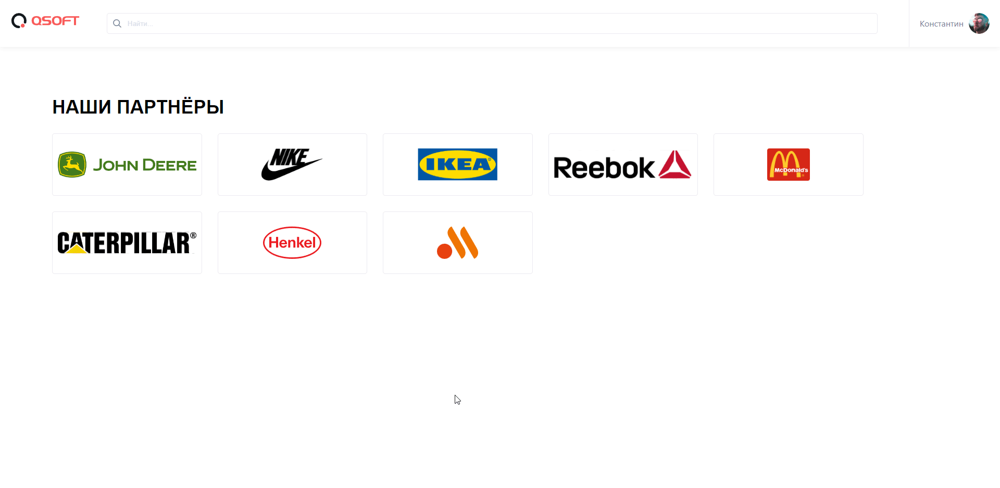

# QSOFT Тестовое задание на верстальщика
Необходимо, сверстать страницу сайта, выполнив при этом все требования, указанные ниже.
### Дизайн макет страницы:
 https://www.figma.com/file/uy85DPXU715pD16KkshYUZ/QSOFT.-Front-end-Junior-Test-Task?node-id=1642%3A866
### Требования к заданию:
1) Верстка макета должна быть выполнена по методологии БЭМ.
2) Верстка должна быть выполнена с использованием flexbox
3) Верстка должна быть резиновой, т.е. контент должен равномерно растягиваться и занимать 100% ширины страницы в диапазоне от минимального (375px) до максимально возможного размера страницы (согласно макету 1240px)
4) Верстка должна корректно отображаться на разрешениях от 1440px до 375px.
5) Задание нужно выполнить в какой-либо онлайн-платформе для хранения кода (например, CodePen или CodeSandbox). 
### Уточнение
В качестве изображений для партнеров можно использовать ссылки на любые картинки из интернета.
Как проверить себя:
Убедитесь, что на в 3-х точках (375px, 768px, 1440px) ваша страница в браузере выглядит идеально точно также как в макете. Максимальная погрешность в расстояниях и размерах может быть не более 1px
На любом разрешение внутри диапазона элементы не должны "соскакивать" со своих мест

### Мое решение:
